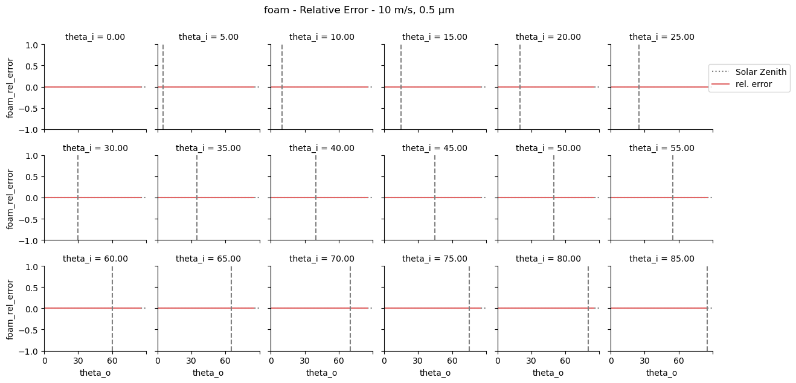
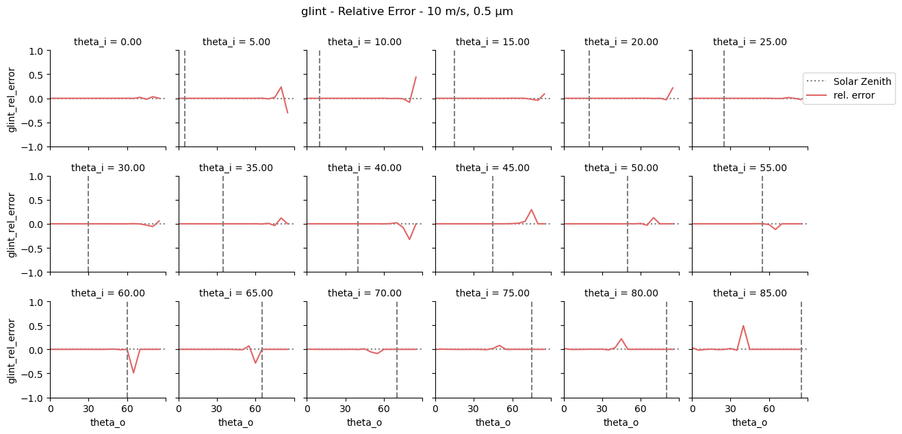
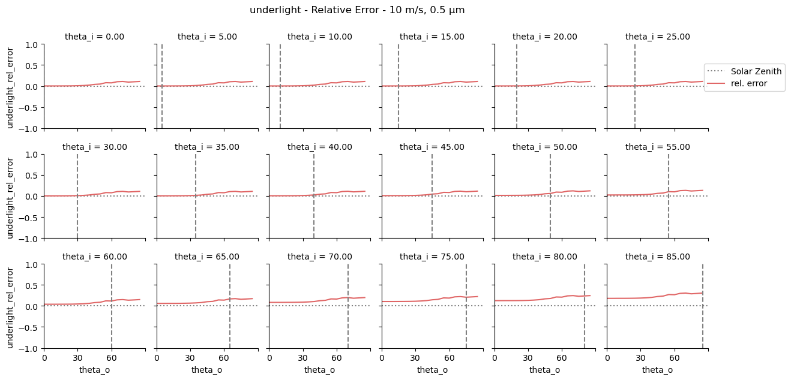
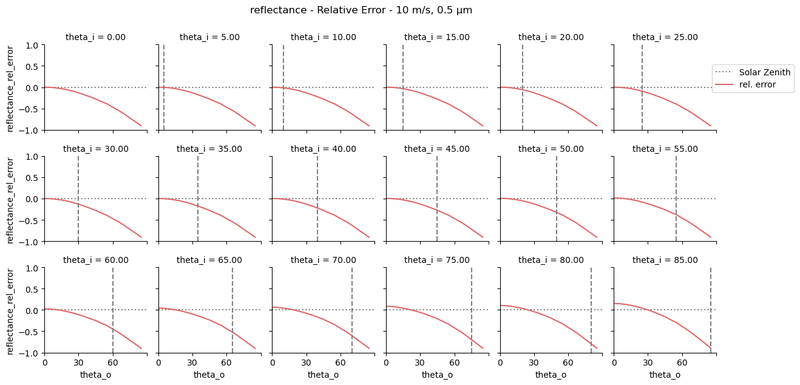
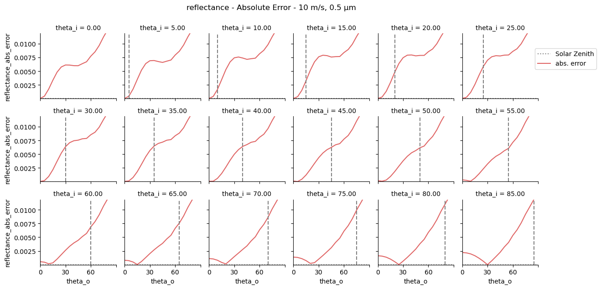

# Oceanic Reflectance Model

This repository contains supporting code for both the 6S and Mitsuba implementations of the oceanic reflectance model. This document provides further details for 

* The workings of the Mitsuba BRDF
* The folder structure
* How to use and run certain files

## Mitsuba BRDF

### Parameters

The Mitsuba BRDF has the following parameters:

* `component` - The component to be evaluated

| Component              | Value | Includes Cosine Foreshortening |
|:----------------------:|:-----:|:------------------------------:|
| Total Reflectance      | 0     | Yes                            |
| Whitecap Reflectance   | 1     | **No**                         |
| Glint Reflectance      | 2     | **No**                         |
| Underlight Reflectance | 3     | **No**                         |

* `wavelength` - The wavelength at which to evaluate the BRDF
* `wind_speed` - The wind speed over the sea (at 10m height)
* `wind_direction` - The direction of the wind, relative to the incoming direction $\phi_i$
* `chlorinity` - The chlorinity of the sea water (logical value is 19)
* `pigmentation` - The pigment concentration of the sea water
* `shininess` - The exponent used for Blinn-Phong in the importance sampling scheme

|      Parameter       |          Range           |   Unit   |
|:--------------------:|:------------------------:|:--------:|
|      Wavelength      |  $\lambda \in [0.2, 4.0]$ |    μm    |
|      Wind Speed      |  $u \in [0, 37.2455]$     |   m/s    |
|   Wind Direction     | $\phi_w \in [0, 2\pi]$    |  radian  |
|      Chlorinity      |   $C \in [0, \infty] $    | g/kg$^{-1}$ |
|     Pigmentation     |    $P \in [0.3, 30]$      | mg/m$^3$ |
|      Shininess       |   $\sigma \in [0, \infty]$ |    /     |

### Initialization

The Mitsuba BRDF can then be initialized as follows:

```python
bsdf = mi.load_dict({
    'type': 'oceanic_legacy',
    'component': 0,
    'wavelength': 0.55,
    'wind_speed': 10,
    'wind_direction': 0,
    'chlorinity': 19,
    'pigmentation': 0.3,
    'shininess': 50,
})
```

### Mitsuba Plugin

The Mitsuba plugin can be found within `ext/mitsuba/eradiate_plugins/bsdfs/oceanic_legacy.cpp`. Tests for consistency can be found within `ext/mitsuba/eradiate_plugins/tests/bsdfs/test_oceanic_legacy.py`. The source code of the Mitsuba plugin itself is completely documented and should be quite self-explanatory.

For multiple importance sampling, a combination of cosine-weighed and Blinn-Phong sampling strategies is used. **THIS SHOULD BE IMPROVED IN THE FUTURE**. 

## Folder Structure

### `6s`

This folder contains notebooks related to extracting various properties (e.g. downwelling transmittance) from the 6S model.

### `brdf`

* `/data` - Directory that contains comparable data from 6S and Mitsuba. Files generated using `validation/validation_gen.ipynb` end up here.

* `brdf_visualization.ipynb` - Tool to visualize the BRDF for a given set of parameters in both rectangular and polar plots.

* `whitecaps.ipynb` - Utility notebook that is used to see the influence of whitecap reflectance, wind speed and wavelength.

### `validation`

The `validation` folder contains all scripts and notebooks that are related to validate the Mitsuba BRDF plugin to the original 6S oceanic reflectance model. 

* `clean.py` - Cleans the result (i.e. `./plots`) directory.

* `data_generation.py` - Scripts used to generate and store data from 6S. The data is stored in the `./data` directory.

* `render_benchmark.ipynb` - Notebook that aims to render an ocean surface, given a specific oceanic BRDF instance.

* `validation_gen.ipynb` - Notebook used to generate the necessary data to compare the 6S and Mitsuba ocean reflectance models.

* `validation_test.ipynb` - Notebook used to compare data from the 6S and Mitsuba ocean reflectance models.

* `benchmark.py` - Used to benchmark the data generated from Mitsuba compared to 6S. Running this script will take all the data points collected in the `./data` directory and produce a variety of comparable plots (which will be stored in the `./plots` directory). Benchmarking includes visualizations of the following properties:
    - **Relative error** of total reflectance, as well as each individual component (whitecap, sun glint, underlight)
    - **Absolute error** of total reflectance, as well as each individual component (whitecap, sun glint, underlight)
    - **Percentage formats** of both relative and absolute errors
    - **Component contributions**, both in percentages and true values
    - **Channel comparisons** of the total, whitecap, glint and underlight reflectances

**IMPORTANT NOTICE**: While the relative error may indicate serious issues with the model, this is actually not the case. Due to the extremely small differences, the relative error explodes. To verify the validity, make sure to always take a look at *both the relative **and** absolute errors*!

To generate other benchmarks, the `benchmark.py` script can be adapted to run for other wavelengths/wind speeds/etc.

<details>
<summary>Example Report</summary>
For the wavelength of 0.5 μm and a wind speed of 10 m/s, the following plots can be viewed:

* *Foam Relative Error*


* *Glint Relative Error*


* *Underlight Relative Error*


Notice that the underlight here is the only component which shows consistent error. In this case, this is potentially due to numerical differences between 6S and Mitsuba (C++) **and** the fact that the quadrature resolution in Mitsuba to compute this plot was halved, resulting in a less accurate quadrature evaluation of the underlight.

We can also take a look at the total reflectance:

* *Reflectance Relative Error*


This seems alarming, until we take a look at the absolute error.

* *Reflectance Absolute Error*


This proves that the Mitsuba implementation is never off by more than 0.01. The reason for the large relative error is in this case due to the comparison of extremely small values, which is numerically unstable.

Finally, we can take a look at the contribution of each component:

* *Component Contributions*
/Components%20(Mitsuba)_10ms_0.5.png)

* *Component Contributions*
/Component%20Contribution%20(Mitsuba)_10ms_0.5.png)

</details> 